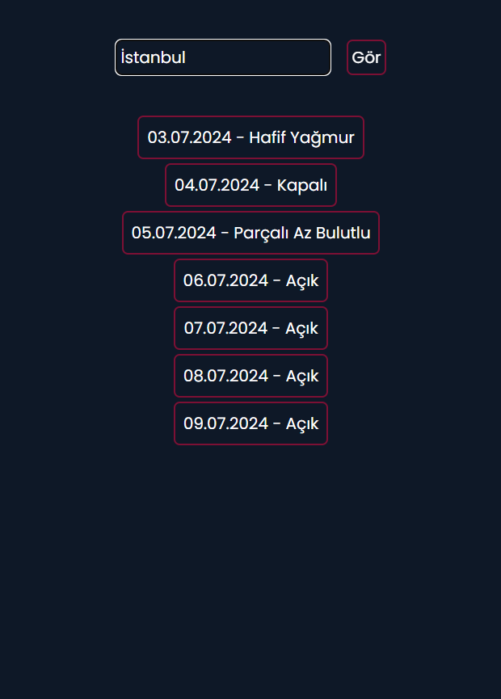

## ⛅ `Weather App`

<br>

- URL

```url
https://weather-app-furkankayam.netlify.app/
```

<br>

- ✅ Weather App

<br>



<br>
<br>

Used Technologies in The Project:

[](https://react.dev/)
[](https://auto-animate.formkit.com/)
[](https://tailwindcss.com/)
[](https://web.dev/explore/progressive-web-apps?hl=tr)
[](https://collectapi.com/tr/)
[](https://axios-http.com/docs/intro)

<br>

### Installation

```bash
git clone https://github.com/furkankayam/weather-app.git
```

<br>

### Usage

```bash
npm run dev
```

<br>

### URL

```bash
http://localhost
```

<br>

<br>

# License

This project is licensed under the MIT License. See the [LICENSE](./LICENSE) file for details
